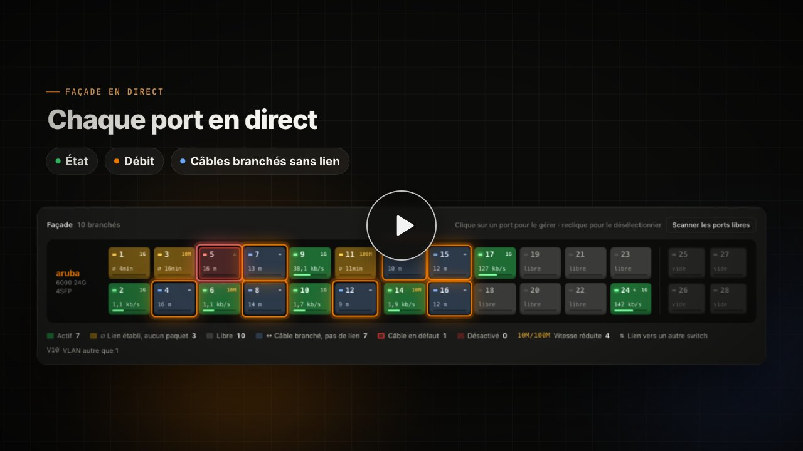

# My Aruba Manager

**Superviser et piloter un switch HPE Aruba Networking CX depuis n’importe où, dans le navigateur, sans ouvrir un seul port sur le réseau.**

Un tableau de bord web pour les switches **HPE Aruba Networking CX** (AOS-CX) : façade en direct, débits et historique,
appareils connectés avec leur IP, VLANs, test de câble, console de commandes, alertes et outils d’administration.
Pensé pour les écoles, les formations réseau (BTS SIO, BTS CIEL, IUT) et les petites structures, avec une interface en français.
Il fonctionne avec les offres gratuites de Vercel et de Supabase et s’appuie sur un petit agent Python installé sur un PC du réseau.

[](https://github.com/ethanfrq/ArubaDashboardSwitch/releases/latest)
[](LICENSE)
[](#compatibilité-et-limites)

**English version : [README.md](README.md)**

> Créé par **Ethan** ([@ethanfrq](https://github.com/ethanfrq)). Compatible HPE Aruba Networking CX.
>
> Projet indépendant, non affilié à HPE ni approuvé par HPE.
> Aruba, HPE Aruba Networking et AOS-CX sont des marques de Hewlett Packard Enterprise.

[](docs/video/my-aruba-manager.mp4)

[](https://vercel.com/new/clone?repository-url=https%3A%2F%2Fgithub.com%2Fethanfrq%2FArubaDashboardSwitch&env=DASHBOARD_PASSWORD,SESSION_SECRET,AGENT_TOKEN&envDescription=Mot%20de%20passe%20du%20dashboard%2C%20cl%C3%A9%20de%20session%20et%20jeton%20de%20l%27agent&project-name=my-aruba-manager)

---

## Fonctionnalités

### Supervision
- **Façade en direct** : chaque port avec son état, sa vitesse négociée et son débit. Les ports lents (10/100 Mb/s),
  les liens vers d’autres switches et les ports « branchés mais sans trafic » sont signalés.
- **Câbles détectés sans lien** : un scan des ports libres indique s’il y a un câble, sa longueur et s’il est en défaut.
- **Ports « libres » vérifiés** : un port sans lien n’est affiché libre que si un test de câble récent le confirme.
  Les ports jamais testés, ou branchés et débranchés depuis le dernier test, passent « à vérifier » et sont testés
  automatiquement par petits lots ; les autres sont revérifiés toutes les 2 h (désactivable dans les réglages).
- **Débits et historique** : la dernière heure en direct, puis 24 h, 7 jours et 30 jours, au total ou port par port.
- **Ports et appareils** : un tableau unique (nom, IP, MAC, débit, erreurs) avec recherche et tri.
- **Santé du switch** : CPU, mémoire, températures, temps de fonctionnement, IP, MAC, numéro de série, firmware.
- **Configuration non sauvegardée** signalée dans la barre du haut, avec sauvegarde en un clic.
- **Spanning-tree** : switch racine, ports bloqués (boucle réseau), trafic broadcast anormal.
- **Historique de chaque port** : depuis quand il est branché ou coupé, nombre de coupures, ports instables.
- **Journal du switch** : les derniers événements traduits en français (liens, connexions, spanning-tree).
- **Relevé fréquent sans charger le switch** : état des liens et journal toutes les 30 s, spanning-tree et
  configuration sauvegardée toutes les 2 min ; les commandes peu changeantes sont espacées et tout ralentit
  si le CPU du switch monte.

### Gestion
- Activer, désactiver ou redémarrer un port, changer sa description.
- **VLANs** : créer, renommer, supprimer, affecter des ports.
- **Test de câble** (TDR) : longueur et état de chaque paire, avec un verdict en clair.
- **Console** : n’importe quelle commande CLI ; les questions oui/non du switch s’affichent sous forme de boutons.
- Sauvegarde de la configuration en un clic.

### Administration sans toucher au code
Tout se règle depuis la carte **Administration** et les réglages ⚙ :
- **Annuler une modification** : avant chaque changement, le dashboard crée un point de restauration sur le switch.
  On voit ce qui sera annulé, puis on revient en arrière en un clic (avec CONFIRMER). Pour un changement sensible
  (IP de gestion, lien vers un autre switch…), le switch **annule tout seul au bout de 5 min** si l’on ne confirme pas
  que tout fonctionne : impossible de s’enfermer dehors.
- **Sauvegardes de la configuration** : copie automatique après chaque changement et toutes les 6 h, historique,
  comparaison ligne à ligne entre deux versions, téléchargement (secrets masqués), retour à un point du switch.
- **Profils de port** (Poste élève, Imprimante, Borne Wi-Fi, Serveur, Port libre, modifiables) : VLAN, description,
  protections (BPDU guard, admin-edge, loop-protect) et état appliqués en un clic.
- **Sélection multiple** : Maj+clic ou Ctrl+clic sur les ports (ou l’outil sur mobile), puis une barre d’actions :
  activer, couper, redémarrer, VLAN, description avec numéro automatique, profil, allumer, tester les câbles.
- **Annuaire des appareils** : nommer un PC une fois, son nom le suit sur tous les ports ; historique des ports,
  alerte « nouvel appareil » (facultative). **Plan de brassage** (prise murale, salle, note) par port,
  **export CSV** et **impression** du plan.
- **Actions planifiées** : couper, rallumer ou redémarrer des ports, allumer les PC à heure fixe, exécutées
  même dashboard fermé (jamais si l’agent est hors ligne ; 8 ports ou plus confirmés avec CONFIRMER).
- **Allumer des PC à distance** (Wake-on-LAN) et **ping** depuis le PC de l’agent.
- **Diagnostiquer un port** (étapes claires et conclusion en une phrase) et **« Un appareil ne marche pas ? »**.
- **Bilan de santé** : configuration non sauvegardée, protections des postes, NTP, communauté SNMP par défaut,
  ports inutilisés, câbles, ports lents ou instables… avec correction en un clic.
- **Réglages** : nom du site, fuseau horaire, rythme de l’agent, alertes.
- **Barre latérale** pour passer du tableau de bord aux outils et aux pages du compte, sur ordinateur comme sur téléphone.

### Comptes utilisateurs et rôles
Un compte par personne, chacun avec son mot de passe, et chaque action signée dans le **journal d’activité**.
- **Administrateur** : tout, y compris les comptes.
- **Technicien** : agit sur les ports d’accès (activer, couper, redémarrer, description, VLAN, test de câble,
  Wake-on-LAN, ping, noms des appareils, plan de brassage). Ni console, ni réglages, ni comptes, et jamais un lien vers
  un autre switch. Le serveur vérifie chaque commande ligne par ligne.
- **Lecture seule** : voit tout l’affichage, ne modifie rien. Idéal pour un écran mural (session de 30 jours, rafraîchi toutes les 30 s).
- Page **Utilisateurs** : créer un compte par **lien d’invitation** (valable 48 h, la personne choisit son mot de passe ;
  envoyé par e-mail si Resend est configuré) ou avec un mot de passe choisi ; changer le rôle, exiger la double
  authentification, envoyer un lien de nouveau mot de passe, fermer ses sessions, désactiver ou supprimer.
- **Mon profil** : nom, e-mail, alertes par e-mail, mot de passe, **double authentification** (code à 6 chiffres d’une
  appli comme Google Authenticator ou Microsoft Authenticator, avec des codes de secours à usage unique),
  déconnexion des autres appareils, thème.
- **Vue monitoring** : un bouton masque toutes les commandes sans se déconnecter.

### Alertes
- Par **e-mail** (Resend) et/ou **webhook** (Teams, Slack, Discord, ntfy pour le téléphone…).
- Port surveillé qui tombe ou revient, température trop haute, agent arrêté, lien lent, lien sans trafic,
  nouvel appareil (facultatif), échec d’une action planifiée.

### Confort
- Mode clair / sombre, indicateurs de chargement et notifications sur chaque action.
- Confirmation obligatoire, avec les lignes exactes envoyées au switch, avant toute modification.
- **Vérification après chaque modification** : le dashboard contrôle dans l’état suivant du switch que le changement
  est bien appliqué (port activé ou coupé, VLAN, description, VLAN créé ou supprimé, configuration sauvegardée) et prévient sinon.

---

## Captures d’écran

*Toutes les captures utilisent des données de démonstration (noms, adresses IP et MAC fictifs).*

**Vue d’ensemble** : indicateurs, façade du switch, débit et alertes, en mode clair ou sombre.

<picture>
  <source media="(prefers-color-scheme: dark)" srcset="docs/captures/apercu-sombre.png">
  
</picture>

**Façade en direct** : ports actifs (vert), sans trafic (ambre), câble branché sans lien (bleu, avec sa longueur), câble en défaut (rouge),
état du câble à vérifier (contour ambre).


**Ports et appareils** : un tableau unique avec nom, IP, MAC, débits et erreurs, recherche et tri.


**Détail d’un port** : informations, actions (activer, redémarrer, description, VLAN) et test de câble paire par paire.


**Historique** : débit total ou par port sur 1 h, 24 h, 7 jours ou 30 jours.


**VLAN et console** : chaque VLAN avec sa mini-façade, et une console qui exécute n’importe quelle commande du switch.


**Réglages** : alertes par e-mail et/ou webhook, ports surveillés, seuil de température, vérification automatique des câbles.


---

## Comment ça marche

```
┌──────────┐   SSH    ┌───────────────────┐ HTTPS (sortant) ┌──────────────────┐
│  Switch  │ ◄──────► │  Agent Python     │ ──────────────► │  Vercel          │ ◄── navigateur
│ Aruba CX │          │  (PC du réseau)   │ ◄────────────── │  page + API      │
└──────────┘          └───────────────────┘    commandes    └─────────┬────────┘
                                                                      ▲
                                                                      │ données
                                                                      ▼
                                                         ┌─────────────────────────┐
                                                         │  Supabase (Postgres)    │
                                                         │  tâche 5 min (pg_cron)  │
                                                         └─────────────────────────┘
```

Le switch a une adresse privée, Vercel ne peut donc pas le joindre. Un **agent** installé sur un PC du réseau
lit le switch en SSH, envoie l’état au dashboard et exécute les commandes demandées.
**C’est toujours l’agent qui contacte Vercel, jamais l’inverse** : aucun port à ouvrir sur le réseau.

Vercel héberge la page et l’API. Les données (état du switch, historique, réglages, journal des commandes,
sauvegardes de configuration, annuaire des appareils) sont stockées dans une base **Supabase** (Postgres)
rattachée au projet Vercel. Les tables sont créées automatiquement au premier lancement, et la vérification
toutes les 5 minutes (agent hors ligne, actions planifiées, sauvegardes) est programmée automatiquement
dans Supabase avec pg_cron. Les alertes par e-mail passent par Resend (facultatif).

Pour rester dans les offres gratuites, l’agent envoie l’état toutes les **60 s** quand personne ne regarde,
**30 s** pour un écran lecture seule et **10 s** quand le dashboard administrateur est ouvert. Il relève alors les
commandes toutes les **5 s** (**1,5 s** juste après une commande). La page relit l’état juste après chaque envoi de
l’agent, et ne recharge le journal des commandes, les alertes et le relevé détaillé que lorsqu’ils ont changé.

L’agent **se met à jour tout seul, uniquement à partir des versions publiées** (page
[Releases](https://github.com/ethanfrq/ArubaDashboardSwitch/releases) du dépôt) : le code en cours de
développement n’est jamais installé. En cas d’échec, l’ancienne version est remise en place automatiquement.

---

## Installation

### Ce qu’il faut
- Un switch **HPE Aruba Networking CX** avec une IP de gestion et le SSH activé (`ssh server vrf default`).
- Un **PC allumé en permanence** sur le même réseau que le switch, avec accès à internet.
  Windows est recommandé : l’agent s’y installe en service et le guide pas à pas est écrit pour lui.
  L’agent fonctionne aussi sous macOS et Linux.
- Un compte **Vercel** (offre gratuite Hobby). La base **Supabase** (offre gratuite) s’y ajoute en un clic.
  Il n’y a rien d’autre à souscrire.

### 1. Déployer le dashboard
1. Clique sur **Déployer sur Vercel** ci-dessus. Vercel copie le projet dans ton compte GitHub (ou GitLab, Bitbucket),
   puis demande les trois variables suivantes :

   | Variable | Rôle | Exemple pour la générer |
   |---|---|---|
   | `DASHBOARD_PASSWORD` | mot de passe administrateur de la page | un mot de passe solide et unique |
   | `SESSION_SECRET` | clé de signature des sessions | `openssl rand -base64 32` |
   | `AGENT_TOKEN` | jeton partagé avec l’agent | `openssl rand -hex 32` |

2. Laisse le premier déploiement se terminer : le dashboard ne sera complet qu’une fois la base ajoutée (étape 2).

### 2. Ajouter la base Supabase
1. Dans le projet Vercel, onglet **Storage**, choisis **Supabase** (Marketplace Vercel) avec l’offre gratuite.
2. Choisis la région **Paris (cdg1)** pour garder les données en Europe, puis relie la base au projet.
   Les variables de connexion Supabase sont ajoutées automatiquement au projet : il n’y a rien à copier.
3. Conseillé : vérifie que les fonctions Vercel tournent dans la même région
   (**Settings > Functions > Function Region** : Paris, cdg1).
4. **Redéploie** le projet (onglet **Deployments**, menu ⋯ du dernier déploiement, **Redeploy**)
   pour qu’il prenne en compte les nouvelles variables.

Au premier lancement, le dashboard crée ses tables et programme la vérification toutes les 5 minutes dans Supabase.
Il n’y a pas de script à lancer.

**Alertes par e-mail (facultatif)** : ajoute **Resend** depuis le Marketplace Vercel, puis redéploie.
Variables facultatives : `ALERT_FROM` (expéditeur des e-mails, ex. `Switch <alertes@mon-domaine.fr>`)
et `DASHBOARD_URL` (lien inclus dans les alertes). Les alertes par webhook ne demandent aucun service supplémentaire.

### 3. Installer l’agent
Télécharge l’agent prêt à l’emploi depuis la [dernière version](https://github.com/ethanfrq/ArubaDashboardSwitch/releases/latest)
(fichier `aruba-agent-x.y.z.zip`). Tout est expliqué pas à pas dans [`agent/INSTALLATION-WINDOWS.md`](agent/INSTALLATION-WINDOWS.md)
(en anglais : [`agent/INSTALL-WINDOWS.md`](agent/INSTALL-WINDOWS.md)). En résumé :
1. Python 3 puis `pip install -r requirements.txt` dans le dossier de l’agent.
2. Créer `agent_config.json` à partir de `agent_config.example.json`
   (IP du switch, URL du dashboard, `AGENT_TOKEN`, réseau à scanner pour trouver les IP).
3. Test : `demarrer-agent.bat`, puis installation en service avec `installer-service.bat` (en administrateur).
   L’agent démarre alors avec Windows, sans fenêtre, redémarre tout seul en cas d’erreur
   et se met à jour tout seul à partir des versions publiées sur GitHub.

### 4. Premiers réglages
Ouvre l’URL de ton projet Vercel et connecte-toi avec l’identifiant **`admin`** et `DASHBOARD_PASSWORD`. Puis :
- dans **Mon profil** : indique ton nom et ton e-mail, choisis ton propre mot de passe et **active la double
  authentification** (scanne le QR code, range les codes de secours en lieu sûr, chacun ne sert qu’une fois) ;
- dans **Réglages** : règle les alertes (e-mail, webhook, ports surveillés, seuil de température) ;
- dans **Utilisateurs** : crée un compte par personne, et un compte lecture seule pour un écran de supervision.

`DASHBOARD_PASSWORD` reste valable pour le compte `admin` comme **mot de passe de secours** : garde-le long et secret.

---

## Sécurité

### Ce qui est en place
- Un compte par personne, mots de passe stockés hachés (scrypt, 10 caractères au moins) ; session signée (cookie
  `HttpOnly`, `Secure`, `SameSite=Strict`) ; blocage de 15 minutes après 8 essais ratés.
- Désactiver un compte, changer son mot de passe ou fermer ses sessions le déconnecte partout, tout de suite.
- **Double authentification** (TOTP) par compte, avec des codes de secours à usage unique ; un administrateur peut l’exiger.
- **Journal d’activité** : connexions (et tentatives refusées), changements de comptes, commandes et réglages, avec qui et quand.
- L’agent s’authentifie avec `AGENT_TOKEN`. Le mot de passe SSH du switch **ne quitte jamais le PC de l’agent** :
  il y est chiffré par Windows (DPAPI).
- Rôles vérifiés par le serveur sur chaque requête. Lecture seule : aucune commande hors relevés automatiques (contrôlés
  ligne par ligne), ni historique des commandes, ni détail des différences de configuration. Technicien : seulement les
  commandes de port listées plus haut, contrôlées ligne par ligne, jamais sur un lien vers un autre switch ni une commande sensible.
- Toute modification passe par une fenêtre qui affiche les lignes exactes envoyées au switch.
- Les abréviations AOS-CX (« int 1/1/24 », « shu »…) sont reconnues : elles n’échappent pas à la seconde confirmation.
  Tabulation et caractères de contrôle sont refusés ; un texte saisi (description, nom) ne peut pas ajouter de ligne.
- Les actions automatiques (planifications, nettoyage, sauvegardes) n’exécutent jamais une commande jugée sensible.
- Les commandes dangereuses (redémarrage, effacement, comptes, IP de gestion, liens vers d’autres switches,
  port du PC de l’agent…) exigent une **seconde confirmation imposée par le serveur** :
  jeton à usage unique valable 2 minutes et saisie du mot CONFIRMER.
- **Page web durcie** : Content-Security-Policy stricte (aucun script en ligne) et échappement systématique des données
  venues du réseau (noms d’appareils annoncés en LLDP ou en DNS, descriptions, journal du switch), pour qu’un texte
  piégé ne puisse pas s’exécuter dans la page. La page ne peut pas être affichée dans le cadre d’un autre site.
- L’agent ne se met à jour qu’à partir des **versions publiées** (releases GitHub), jamais à partir du code en cours.
- Aucun secret n’est versionné (`.env*`, `agent_config.json` et `agent_secret.bin` sont exclus).
- Les données restent dans tes propres comptes Vercel et Supabase : l’auteur du projet n’y a pas accès.

### Téléphone perdu (double authentification)
Utilise un des codes de secours. Si tu n’en as plus, un autre administrateur la réinitialise depuis **Utilisateurs**
(bouton **Gérer**). Si tu es le seul administrateur : ouvre la base dans Supabase (depuis Vercel : onglet **Storage**,
ta base, puis **Open in Supabase**), va dans le **Table Editor**, ouvre la table `mam_kv` et supprime la ligne
dont la clé est `mam:totp:owner`. Connecte-toi avec `admin` et le mot de passe, puis réactive-la avec ton nouveau téléphone.

### Mot de passe oublié
Un administrateur envoie un lien de nouveau mot de passe depuis **Utilisateurs**. Pour le compte `admin`,
`DASHBOARD_PASSWORD` (réglages Vercel) fonctionne toujours comme mot de passe de secours.

### Recommandations
- Choisis un mot de passe administrateur **solide et unique**, différent de celui du switch.
- **Active la double authentification** dès la première connexion.
- Idéalement, l’interface d’administration d’un équipement réseau n’est accessible **que par un VPN**
  (WireGuard, Tailscale), plutôt qu’exposée publiquement. En mode Vercel, la page est par construction accessible
  depuis internet : le mot de passe et la double authentification sont donc indispensables. Le mode local prévu
  dans la [feuille de route](#feuille-de-route) permettra un accès limité au réseau local ou au VPN.
- Ne partage pas l’URL inutilement ; donne à chacun le plus petit rôle qui suffit, et un compte lecture seule à un écran d’affichage.
- Télécharge régulièrement les sauvegardes de configuration importantes : l’offre gratuite de Supabase
  ne sauvegarde pas la base automatiquement.

### Limites du mode Vercel
- L’offre **Hobby de Vercel est réservée à un usage personnel et non commercial**. Pour une entreprise ou un service
  facturé, il faut une offre payante de Vercel (ou attendre le mode local prévu dans la feuille de route).
- Les offres gratuites de Vercel et de Supabase **ne prévoient pas de contrat de sous-traitance RGPD**.
  Le dashboard stocke des adresses IP et MAC, des noms d’appareils et le journal des actions, qui peuvent être
  des données personnelles. **Pour une école ou une structure, fais valider ce choix par le responsable**
  (chef d’établissement, responsable informatique, DPO) avant la mise en service.

---

## Compatibilité et limites
- Testé sur un **HPE Aruba Networking CX 6000 24G 4SFP** (AOS-CX 10.15). La façade est pensée pour les modèles
  24 ports + 4 SFP. D’autres modèles CX peuvent fonctionner mais n’ont pas été testés.
- Le switch est lu par la CLI en SSH : l’analyse des réponses peut dépendre de la version du firmware.
- Un switch par dashboard, un agent par switch.
- Interface en français uniquement.
- Offre Vercel gratuite : 12 fonctions au plus par déploiement ; le projet est conçu pour tenir dans cette limite.
- Offre Supabase gratuite :
  - 500 Mo de base de données et 5 Go de bande passante sortante par mois ;
  - projet mis en pause après 7 jours sans activité. L’agent écrit en continu : cela n’arrive que si le PC de l’agent
    reste éteint une semaine. Le projet se relance alors depuis le tableau de bord Supabase ;
  - pas de sauvegarde automatique de la base.

## Feuille de route
Prochaines étapes prévues, sans date :
- **Mode local tout-en-un** : l’agent devient le serveur (page et API sur le PC du réseau), base SQLite,
  aucun compte cloud, image Docker. Accès depuis le réseau local ou par VPN.
- **Lecture du switch par l’API REST d’AOS-CX** au lieu de la CLI en SSH.
- **Plusieurs switches** dans un même dashboard.

## Structure du projet
| Dossier | Contenu |
|---|---|
| `public/index.html` | l’interface (une seule page, sans framework) |
| `public/js/` | les fonctions d’administration côté page, une par fichier |
| `public/vendor/` | bibliothèque tierce servie avec la page (QR code de la double authentification) |
| `api/` | fonctions Vercel (Node 24) |
| `lib/` | base de données (Supabase, Postgres), comptes, rôles (administrateur, technicien, lecture seule), double authentification, journal d’activité, notifications |
| `lib/features/` | la partie serveur des fonctions d’administration |
| `agent/` | l’agent Python, sa mise à jour automatique et son installation en service Windows |
| `docs/` | captures d’écran et vidéo de présentation |

---

## Auteur
Conçu et développé par **Ethan** ([@ethanfrq](https://github.com/ethanfrq)).

## Contribuer
Les [issues](https://github.com/ethanfrq/ArubaDashboardSwitch/issues) et les
[pull requests](https://github.com/ethanfrq/ArubaDashboardSwitch/pulls) sont les bienvenues : bug, idée,
question, compatibilité avec un autre modèle de switch CX…
- Pour un bug ou un autre modèle de switch, indique le modèle, la version d’AOS-CX et la version de l’agent.
  Retire les adresses IP et MAC, les noms et les secrets de ce que tu partages.
- Pour une modification importante, ouvre d’abord une issue pour en discuter.
- En proposant une contribution, tu acceptes qu’elle soit publiée sous licence Apache 2.0 (section 5 de la licence).

## Versions
Les nouveautés de chaque version sont dans [`CHANGELOG.md`](CHANGELOG.md) et sur la page [Releases](https://github.com/ethanfrq/ArubaDashboardSwitch/releases).

## Licence
My Aruba Manager est distribué sous **licence Apache 2.0** : voir [`LICENSE`](LICENSE).
Tu peux l’utiliser, le modifier et le redistribuer, y compris dans un cadre commercial, à condition de joindre
la licence, de conserver les mentions de copyright et le fichier [`NOTICE`](NOTICE), et de signaler les fichiers modifiés.
La licence ne donne aucun droit sur les noms et marques.

Les composants tiers utilisés (postgres, qrcode-generator, paramiko…) restent sous leur propre licence :
voir [`THIRD-PARTY-NOTICES.md`](THIRD-PARTY-NOTICES.md).

## Marques
Aruba, HPE Aruba Networking et AOS-CX sont des marques de Hewlett Packard Enterprise.
My Aruba Manager est un projet indépendant, non affilié à HPE ni approuvé par HPE ;
ces noms ne sont utilisés que pour indiquer la compatibilité.
