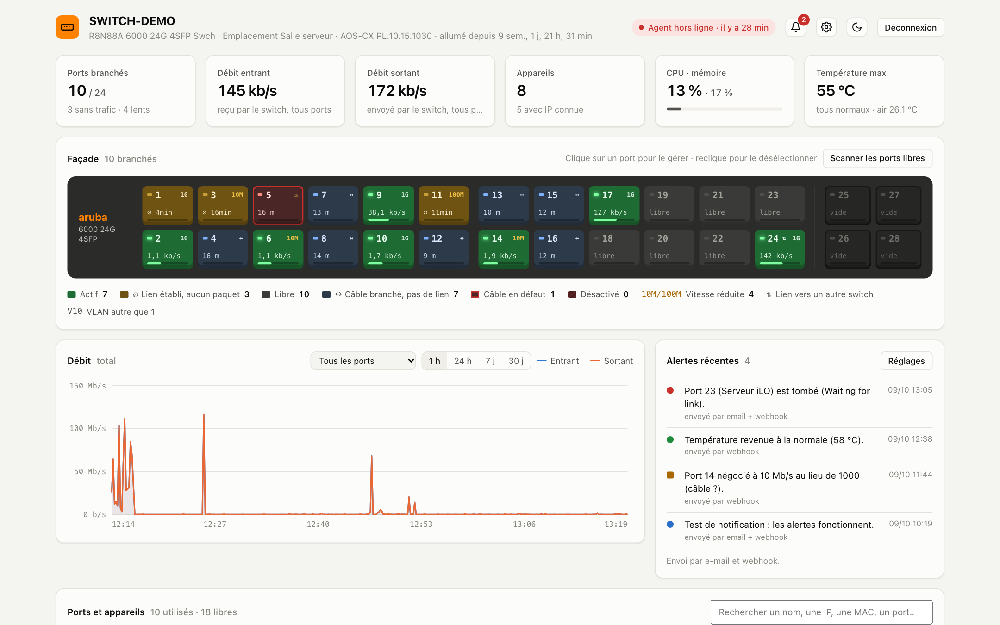
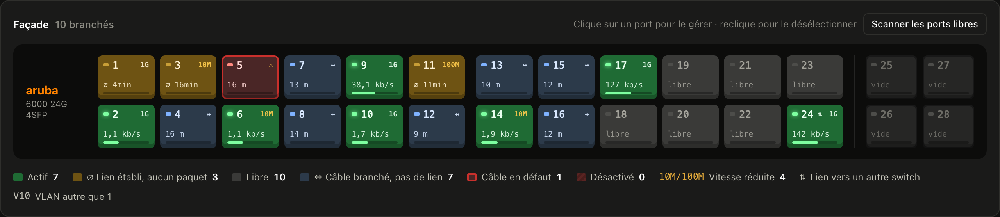
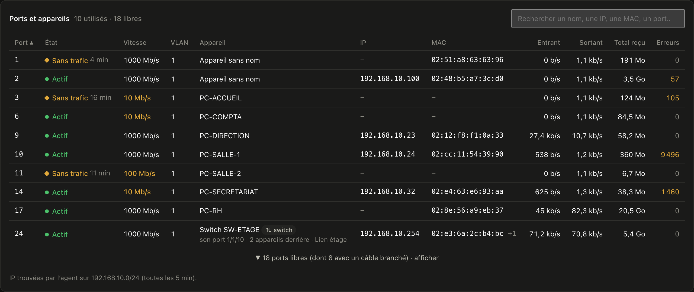
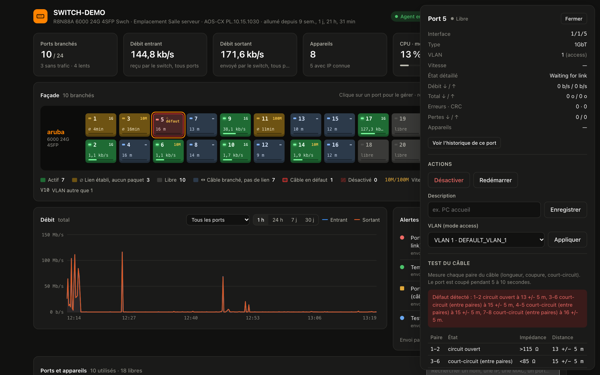
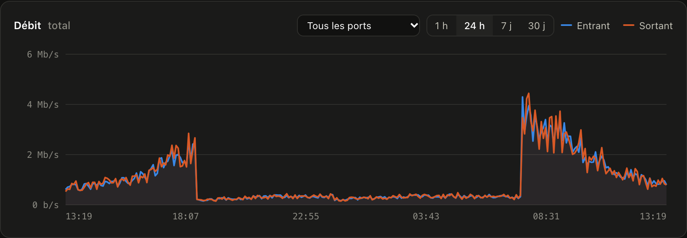
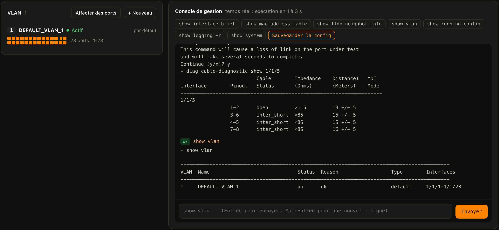
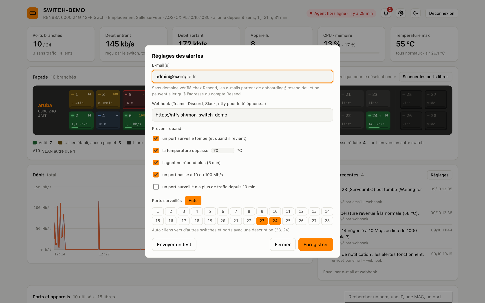

# Aruba Dashboard Switch

**Superviser et piloter un switch Aruba CX depuis n’importe où, dans le navigateur, sans ouvrir un seul port sur le réseau.**

Un tableau de bord web moderne pour les switches **HPE Aruba Networking CX** (AOS-CX) : façade en direct, débits et historique,
appareils connectés avec leur IP, VLANs, test de câble, console de commandes et alertes.
Hébergé gratuitement sur Vercel, alimenté par un petit agent Python installé sur un PC du réseau.

[](https://github.com/ethanfrq/ArubaDashboardSwitch/releases/latest)
[](LICENSE)
[](#compatibilité-et-limites)

[](https://vercel.com/new/clone?repository-url=https%3A%2F%2Fgithub.com%2Fethanfrq%2FArubaDashboardSwitch&env=DASHBOARD_PASSWORD,SESSION_SECRET,AGENT_TOKEN&envDescription=Mot%20de%20passe%20du%20dashboard%2C%20cl%C3%A9%20de%20session%20et%20jeton%20de%20l%27agent&project-name=aruba-dashboard)

> Créé par **Ethan** ([@ethanfrq](https://github.com/ethanfrq)).

<picture>
  <source media="(prefers-color-scheme: dark)" srcset="docs/captures/apercu-sombre.png">
  
</picture>

---

## Fonctionnalités

### Supervision
- **Façade en direct** : chaque port avec son état, sa vitesse négociée et son débit. Les ports lents (10/100 Mb/s),
  les liens vers d’autres switches et les ports « branchés mais sans trafic » sont signalés.
- **Câbles détectés sans lien** : un scan des ports libres indique s’il y a un câble, sa longueur et s’il est en défaut.
- **Débits et historique** : la dernière heure en direct, puis 24 h, 7 jours et 30 jours, au total ou port par port.
- **Ports et appareils** : un tableau unique (nom, IP, MAC, débit, erreurs) avec recherche et tri.
- **Santé du switch** : CPU, mémoire, températures, temps de fonctionnement, IP, MAC, numéro de série, firmware.
- **Configuration non sauvegardée** signalée dans la barre du haut, avec sauvegarde en un clic.
- **Spanning-tree** : switch racine, ports bloqués (boucle réseau), trafic broadcast anormal.
- **Historique de chaque port** : depuis quand il est branché ou coupé, nombre de coupures, ports instables.
- **Journal du switch** : les derniers événements traduits en français (liens, connexions, spanning-tree).

### Gestion
- Activer, désactiver ou redémarrer un port, changer sa description.
- **VLANs** : créer, renommer, supprimer, affecter des ports.
- **Test de câble** (TDR) : longueur et état de chaque paire, avec un verdict en clair.
- **Console** : n’importe quelle commande CLI ; les questions oui/non du switch s’affichent sous forme de boutons.
- Sauvegarde de la configuration en un clic.

### Alertes
- Par **e-mail** (Resend) et/ou **webhook** (Teams, Slack, Discord, ntfy pour le téléphone…).
- Port surveillé qui tombe ou revient, température trop haute, agent arrêté, lien lent, lien sans trafic.

### Confort
- Mode clair / sombre, indicateurs de chargement et notifications sur chaque action.
- Confirmation obligatoire, avec les lignes exactes envoyées au switch, avant toute modification.

---

## Captures d’écran

*Toutes les captures utilisent des données de démonstration (noms, adresses IP et MAC fictifs).*

**Façade en direct** : ports actifs (vert), sans trafic (ambre), câble branché sans lien (bleu, avec sa longueur), câble en défaut (rouge).



**Ports et appareils** : un tableau unique avec nom, IP, MAC, débits et erreurs, recherche et tri.



**Détail d’un port** : informations, actions (activer, redémarrer, description, VLAN) et test de câble paire par paire.



**Historique** : débit total ou par port sur 1 h, 24 h, 7 jours ou 30 jours.



**VLAN et console** : chaque VLAN avec sa mini-façade, et une console qui exécute n’importe quelle commande du switch.



**Alertes** : e-mail et/ou webhook, ports surveillés, seuil de température.



---

## Comment ça marche

```
┌──────────┐   SSH    ┌───────────────────────┐   HTTPS (sortant)   ┌──────────────────────┐
│  Switch  │ ◄──────► │  Agent Python         │ ──────────────────► │  Vercel              │ ◄── navigateur
│ Aruba CX │          │  (PC du réseau local) │ ◄────────────────── │  page + API          │
└──────────┘          └───────────────────────┘     commandes       └──────────┬───────────┘
                                                                     Upstash Redis · QStash · Resend
```

Le switch a une adresse privée, Vercel ne peut donc pas le joindre. Un **agent** installé sur un PC du réseau
lit le switch en SSH, envoie l’état au dashboard et exécute les commandes demandées.
**C’est toujours l’agent qui contacte Vercel, jamais l’inverse** : aucun port à ouvrir, aucun VPN.

Pour rester dans les offres gratuites, l’agent envoie l’état toutes les **60 s** quand personne ne regarde,
toutes les **10 s** quand le dashboard est ouvert, et relève alors les commandes toutes les **1,5 s**.

---

## Installation

### Ce qu’il faut
- Un switch **Aruba CX** avec une IP de gestion et le SSH activé (`ssh server vrf default`).
- Un **PC allumé en permanence** sur le même réseau que le switch, avec accès à internet
  (Windows recommandé, macOS et Linux fonctionnent aussi).
- Un compte **Vercel** (offre gratuite suffisante).

### 1. Déployer le dashboard
1. Clique sur **Déployer sur Vercel** ci-dessus et renseigne les trois variables demandées :

   | Variable | Rôle | Exemple pour la générer |
   |---|---|---|
   | `DASHBOARD_PASSWORD` | mot de passe de la page | un mot de passe solide et unique |
   | `SESSION_SECRET` | clé de signature des sessions | `openssl rand -base64 32` |
   | `AGENT_TOKEN` | jeton partagé avec l’agent | `openssl rand -hex 32` |

2. Dans le projet Vercel, onglet **Storage / Integrations**, ajoute **Upstash for Redis** et **Upstash QStash**
   (et **Resend** si tu veux les alertes par e-mail), puis redéploie.
3. Active la vérification « agent hors ligne » (toutes les 5 minutes) :
   ```bash
   vercel env pull .env.local
   DASHBOARD_URL=https://ton-projet.vercel.app node --env-file=.env.local scripts/setup-qstash.mjs
   ```

Variables facultatives : `ALERT_FROM` (expéditeur des e-mails, ex. `Switch <alertes@mon-domaine.fr>`)
et `DASHBOARD_URL` (lien inclus dans les alertes).

### 2. Installer l’agent
Télécharge l’agent prêt à l’emploi depuis la [dernière version](https://github.com/ethanfrq/ArubaDashboardSwitch/releases/latest)
(fichier `aruba-agent-x.y.z.zip`). Tout est expliqué pas à pas dans [`agent/INSTALLATION-WINDOWS.md`](agent/INSTALLATION-WINDOWS.md). En résumé :
1. Python 3 puis `pip install -r requirements.txt` (dans le dossier de l’agent).
2. Copier le dossier `agent` sur le PC et créer `agent_config.json` à partir de `agent_config.example.json`
   (IP du switch, URL du dashboard, `AGENT_TOKEN`, réseau à scanner pour trouver les IP).
3. Test : `demarrer-agent.bat`, puis installation en service avec `installer-service.bat` (en administrateur).
   L’agent démarre alors avec Windows, sans fenêtre, et redémarre tout seul en cas d’erreur.

### 3. C’est prêt
Ouvre l’URL de ton projet Vercel, connecte-toi, puis règle les alertes avec l’icône ⚙.

---

## Sécurité
- Page protégée par mot de passe ; session signée (cookie `HttpOnly`, `Secure`, `SameSite=Strict`) ;
  blocage de 15 minutes après 8 essais ratés.
- L’agent s’authentifie avec `AGENT_TOKEN` ; la vérification planifiée avec la signature QStash.
- Le mot de passe SSH du switch **ne quitte jamais le PC de l’agent** : il y est chiffré par Windows (DPAPI).
- Toute modification passe par une fenêtre qui affiche les lignes exactes envoyées au switch.
- Les commandes dangereuses (redémarrage, effacement, comptes, IP de gestion, liens vers d’autres switches,
  port du PC de l’agent…) exigent une **seconde confirmation imposée par le serveur** :
  jeton à usage unique valable 2 minutes et saisie du mot CONFIRMER.
- Aucun secret n’est versionné (`.env*`, `agent_config.json` et `agent_secret.bin` sont exclus).

> Le dashboard donne un accès administrateur au switch depuis internet : choisis un mot de passe solide,
> différent de celui du switch, et ne partage pas l’URL inutilement.

## Compatibilité et limites
- Testé sur un **Aruba CX 6000 24G 4SFP** (AOS-CX 10.15). La façade est pensée pour les modèles 24 ports + 4 SFP.
- Offre Vercel gratuite : 12 fonctions maximum par déploiement (le projet les utilise toutes).
- Un agent par switch.

## Structure du projet
| Dossier | Contenu |
|---|---|
| `public/index.html` | l’interface (une seule page, sans framework ni dépendance) |
| `api/` | fonctions Vercel (Node 24) |
| `lib/` | Redis, authentification, notifications |
| `agent/` | l’agent Python et son installation en service Windows |
| `scripts/` | création de la vérification planifiée QStash |

---

## Auteur
Conçu et développé par **Ethan** ([@ethanfrq](https://github.com/ethanfrq)).

Une idée, un bug, une question ? Ouvre une [issue](https://github.com/ethanfrq/ArubaDashboardSwitch/issues).

## Versions
Les nouveautés de chaque version sont dans [`CHANGELOG.md`](CHANGELOG.md) et sur la page [Releases](https://github.com/ethanfrq/ArubaDashboardSwitch/releases).

## Licence
© 2026 Ethan ([@ethanfrq](https://github.com/ethanfrq)). Tous droits réservés. Voir [`LICENSE`](LICENSE).

Les composants libres utilisés (Upstash, paramiko…) restent sous leur propre licence :
voir [`THIRD-PARTY-NOTICES.md`](THIRD-PARTY-NOTICES.md).

*Aruba, HPE Aruba Networking et AOS-CX sont des marques de Hewlett Packard Enterprise.
Ce projet est indépendant et n’est ni affilié à HPE ni approuvé par HPE.*
